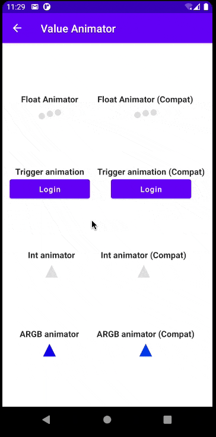

# Value Animator

API that provides you the same functionality from non-compose ValueAnimator, but using compose APIs.

This lib aims to provide a way to animate a value with multiple "checkpoints" between the start and end.

## API

The usage is pretty similar to the default Compose Animations. This library contains the following 
functions:

- **animateFloatValuesAsState**
- **animateIntValuesAsState**
- **animateDpValuesAsState**
- **animateSizeValuesAsState**
- **animateOffsetValuesAsState**
- **animateRectValuesAsState**
- **animateIntOffsetValuesAsState**
- **animateIntSizeValuesAsState**
- **animateColorValuesAsState**

The usage is the same for all of them. The example below will be using the `Float` type, but you 
can replace it with any other available.

```kotlin
val ballScale = animateFloatValuesAsState(
    1f, 0.75f, 1f, 0.5f, 1f, // passing values as varargs
    animationSpec = infiniteRepeatable(
        animation = tween(durationMillis = 1000),
    )
)

// or

val ballScale = animateFloatValuesAsState(
    values = arrayOf(1f, 0.75f, 1f, 0.5f, 1f), // passing values as array
    animationSpec = infiniteRepeatable(
        animation = tween(durationMillis = 1000),
    )
)
```

### Using custom types

If you have a custom type that you want to perform this same animation, you can use the 
`animateValuesAsState` function. It has the same syntax as the ones listed above, but you need to 
provide one instance of `ValueAtFraction<T>` to convert the progress to one value from the instance.

Here is the implementation used for the `Float` version that you can use as an example.

```kotlin
val floatAtFraction = ValueAtFraction<Float> { fraction, initialValue, finalValue ->
    initialValue + (finalValue - initialValue) * fraction
}
```

With this instance, you can now use the `animateValuesAsState`.

```kotlin
@Composable
fun animateFloatValuesAsState(
    vararg values: Float,
    startDelay: Long = 0,
    animationSpec: AnimationSpec<Float> = spring(),
): State<Float> = animateValuesAsState(
    values = values.toTypedArray(),
    getValueAtFraction = floatAtFraction,
    startDelay = startDelay,
    animationSpec = animationSpec,
)
```

## Demo


